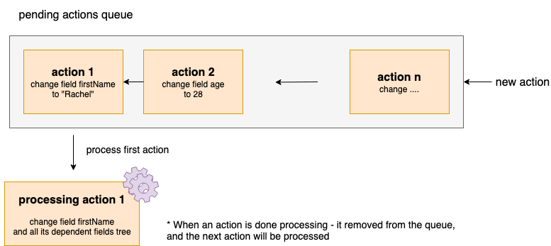

`array of objects` - An array which contains actions that the form should process. Since all form's actions are async functions - there is a need for actions queue - in case an action was called before the last action was finished to process - in order to keep data integrity. The `model.pendingActions` is handled as FIFO queue - first in first out. I.e - first action that occurred is the first to be handled. Only when an action is done processing then the form will remove it from the queue and process the next action in the queue.
When the form is processing a single action it waits for the entire process and side effects to finish. For example is a field changes it value and caused some more fields to be updated (because they were dependent on it), then the form waits for the entire side effects to finish before handling the next action in the pendingActions queue.

There is no need to pass it in the initial form model json. It initialize to empty array, and later will be updated on each action that the form will receive (for example change field value).

## Demo



## Example
```
pendingActions: [{
  type: 'CHANGE_FIELD_VALUE',
  func: executeAction, // a function that will update the value in the form
  args: ['userForm', 'firstName', 'Monica'], // [formId, fieldId, value]
}, {
  type: 'CHANGE_FIELD_VALUE',
  func: executeAction, // a function that will update the value in the form
  args: ['userForm', 'age', 28], // [formId, fieldId, value]
}]
```
## Usage Example

Disable a save button when form is processing - i.e when [model.processing](processing.html).

## Pending actions queue functions

Internally - form class uses the following functions cycle:

### Add action

1. add a new action to the end of the queue
1. if form is not currently processing 
  - Announce start processing
  - call process queue

### Process queue

1. Fetch first action (FIFO - first in first out)
1. Announce start action
1. Run before hooks: 
   - `beforeAction`
   - `beforeDataChange` (if action is one of: `init`, `changeValue`, `changeData`, `reset`)
   - `before{actionName}` (such as `beforeInit`)
1. Run action (and its side effects like dependent fields changes)
1. Run after hooks:
   - `afterAction`
   - `afterDataChange` (if action is one of: `init`, `changeValue`, `changeData`, `reset`)
   - `after{actionName}` (such as `afterInit`)
1. Announce end action
1. Resolve the action
1. Remove action from the queue
1. If the form does not exists on the store anymore (after  destroy action), or if the queue is empty
   - Announce end processing
   - return
1. Recursive - run process queue (to process next action in the queue)

## Why using pending actions queue

Look at the following form definition

```
const model = {
  id: 'process-queue',
  data: {},
  fields: {
    name: {
      path: 'name',
      validators: [{
        name: 'uniqueName',
      }],
    },
  },
};

const resources = {
  validators: {
    uniqueName: {
      func: (props) => { // only fails on Rachel
        // mock server names
        const serverNames = ['Rachel'];
        if (!serverNames.includes(props.value)) return true;

        // when value is Rachel - wait and return false
        return new Promise((resolve) => {
          setTimeout(() => {
            resolve(false);
          }, 400); // wait more time than the debounce and change value cycle
        });
      },
      message: props => `The name: '${props.value}' is already taken`,
    },
  },
};
```

Test using `@cofi/form` - JavaScript form class

```
/*
This was a bug that failed the below test before the pending actions queue was added. The order of what happen was:
1. set name Rachel
2. set name Monica
3. validate monica + update form invalid -> Form is valid
4. validate rachel + update form invalid -> Form is invalid

The correct order - using pending actions queue - needs to be 
(the test is passing after adding the pending actions queue feature)
1. set name Rachel
2. validate rachel + update form invalid -> Form is invalid
3. set name Monica
4. validate monica + update form invalid -> Form is valid
*/
it('react-form demonstration - mimics a ui form actions that cant use await
for each action - since they are triggered from a different code blocks', async () => {
  const form = new Form();
  await form.init(model, resources);
  expect(form.data).toEqual({});
  expect(form.invalid).toBeFalsy();

  // react form case - fails (without having await one after another in the same code block -
  // can call action parallel from the ui)
  form.changeFieldValue('Rachel', 'name');
  await wait(250); // wait for debounce to finish
  form.changeFieldValue('Monica', 'name');
  await wait(1000); // wait for process to finish

  expect(form.data).toEqual({ name: 'Monica' });
  expect(form.invalid).toBeFalsy();
});
```