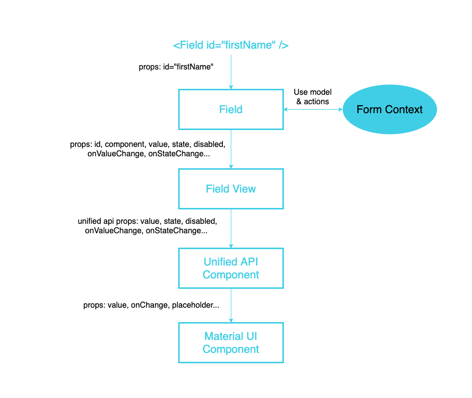
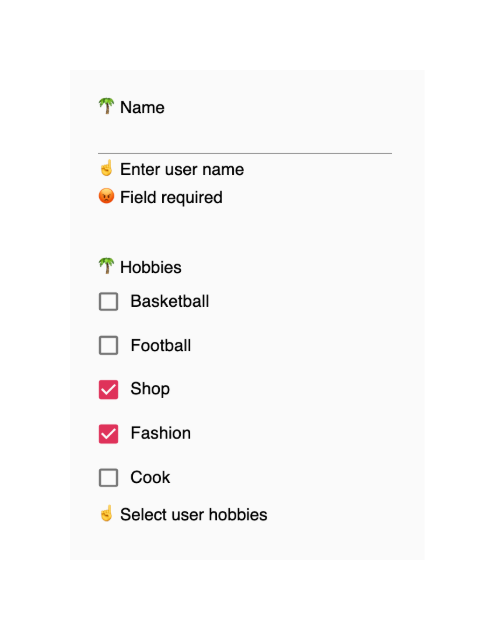

Field component is a specific child component that uses the Form's context to get data from the form and change 
the form data.

## Field Component

`@cofi/react-form/Field` serves as a default field component. Its the result of `createField(SomeFieldView)` HOC (that pass the underline field view component all the data that the field view needs to render) and a default `FieldView` component:

```javascript
import createField from './createField';
import FieldView from './FieldView';

export default createField(FieldView);
```

### Props

| Name          | Type          | Description |
| ------------- |-------------| ------------|
| id         | required string | Field id as represented in the json of `model.fields` object keys |


> **Note:** Field component propagates every property to the component it wraps, except for cofi-reserved properties, that appear in
[Field View](react-field.html#field-view). However, specifying the property outside of Cofi's context also means it is not part of the lifeycycle of Cofi any more. Therefore, we strongly recommend to use Cofi Form configuration `field.component.state` object to pass data for each underline component.

### Usage Example

```javascript
import { Form, Field } from '@cofi/react-form';
import SomeInputText from './my-components/Text.jsx';

const model = {
  id: 'user-form',
  fields: {
    firstName: {
      path: 'firstName',
      label: 'First Name',
      component: {
        name: 'InputText',
      },
    },
    lastName: {
      path: 'lastName',
      label: 'Last Name',
      component: {
        name: 'InputText',
      },
    }
  }
};

const resources = {
  components: {
    InputText: : { renderer: SomeInputText },
  }
};

<Form model={model} resources={resources}>
  <h2>User Details</h2>
  <Field id="firstName" />
  <Field id="lastName" />
</Form>
```

### Structure



## createField(FieldView) HOC

A function that gets a FieldView component as a parameter and returns a new wrapped component, which receives data from the closest Form Provider's context using the `id` prop, and populates props for the FormView from its form's `context.model.fields[id]`.

## Field View

Renders the specified component (for instance, inputText, checkboxList, etc) and some data like label, description and errors. Cofi provides a default FieldView but
any app can design its own field view and use it like `const Field = createField(MyCustomFieldView)`;

#### Note

The fields in `model.fields` represent the form. Each field defines a settings that will affect its lifecycle. If you choose NOT to include a specific field in the render function - the field's lifecycle is still evaluated (meaning that excludeTerm, validations and disableTerm are evaluated nonetheless). 
Keep in mind that all fields are evaluated even without being rendered.

### Props

| Name          | Type          | Description |
| ------------- |-------------| ------------|
| id | required string | Field id |
| label | string | Field label |
| description | string | Field info |
| component | function / class | function. React ui component which manipulates the field value. Component should get a set of predefined props as described in [Unified api components](react-components.html) |
| value | any | Value of the field, supplied from the `model.data` |
| state | object | Represents the ui state of the field's component |
| excluded| boolean | Is the field excluded? (and not rendered) |
| disabled | boolean | Is the field disabled? |
| dirty | boolean | Is the field value not equals to its initial value? |
| required | boolean | Is the field required to have a valid value? |
| empty | boolean | Is the field value considered empty? (according to [isEmpty](hooks#isempty) function) |
| invalid | boolean | Is the field invalid? (if a field is required and empty - and have required error, its not considered invalid in terms of UX |
| errors | object array | Current field errors - array of { name, message } |
| styleOverrides | string | Style to override field's default view |
| onValueChange | function | Callback to pass new value for the field |
| onStateChange | function | Callback to pass new component state for the field |

### Default Field View

For the following form definition:

```javascript
import CheckboxCollection from '@cofi/react-components/edit/CheckboxCollection';

const form = {
  id: 'user-form',
  fields: {
    hobbies: {
      label: 'Hobbies',
      path: 'hobbies',
      description: 'Select at least 3 hobbies',
      component: {
        name: 'CheckboxCollection',
        state: {
          items: [
            { label: 'Basketball', value: 'BASKETBALL'},
            { label: 'Football', value: 'FOOTBALL'},
            { label: 'Shop', value: 'SHOP'},
            { label: 'Fashion', value: 'FASHION'},
            { label: 'Cook', value: 'COOK'},
          ]
        },
      },
      required: true,
      validators: [{
        name: 'minLength',
        args: {
          value: 3,
        }
      }]
    },
  },
  data: {
    hobbies: ['SHOP', 'FASHION'],
  }
};

const resources = {
  components: {
    CheckboxCollection: { renderer: CheckboxCollection },
  }
}
```

Default FieldView will render:


#### Override Default Field View Style

Override default [FieldView](react-field) style using `styleOverrides` prop.

Example

```javascript
import { Field } from '@cofi/react-form';

const styleOverrides = `
  width: 400px;
  margin: 0;
  
  [aria-label="Label"], [aria-label="Required"], [aria-label="Error"] {
    color: orange;
  }
`;

const StyledField = (props) => (<Field styleOverrides={styleOverrides} { ...props } />);


<StyledField id="firstName">
<StyledField id="lastName">
```

### Custom Field View

Defined a custom [FieldView](react-field) component in order to change the field's view.

Example
```javascript
// CustomFieldView.jsx
import React from 'react';
import noop from 'lodash/noop';
import styled from 'styled-components';

const Field = styled.div`
  margin-bottom: 40px;
`;

export default ({
  id = undefined,
  label = undefined,
  description = undefined,
  value = undefined,
  excluded = false,
  disabled = false,
  dirty = false,
  required = false,
  empty = false,
  invalid = false,
  errors = [],
  state = {},
  component = noop,
  onValueChange = noop,
  onStateChange = noop,
  ...customProps
}) => {
  if (excluded) return null;

  const Component = component;

  return (
    <Field id={id} className="field">
      {
        label && <div className="field-label"><span>🌴</span>{label}</div>
      }
      {
        Component && <div className="field-component">
          <Component
            {...customProps}
            value={value}
            state={state}
            disabled={disabled}
            dirty={dirty}
            required={required}
            empty={empty}
            invalid={invalid} 
            onValueChange={onValueChange}
            onStateChange={onStateChange} />
        </div>
      }
      {
        description && <div className="field-description"><span>☝</span>{description}</div>
      }
      {
        errors.map(error => (<div key={error.name} className="field-error">
          <span>😡</span>{error.message}</div>))
      }
    </Field>
  );
};
```

```javascript
// Demo.jsx
import { Form, createField } from '@cofi/react-form';
import { model, resource } from './form';
import CustomFieldView from './CustomFieldView';

// create field with custom view
const Field = createField(CustomFieldView);

<Form model={model} resources={resources}>
  <Field id="name" />
  <Field id="hobbies" />
</Form>
```

Result


You have more detailed example in our [form demos](form-demos.html)